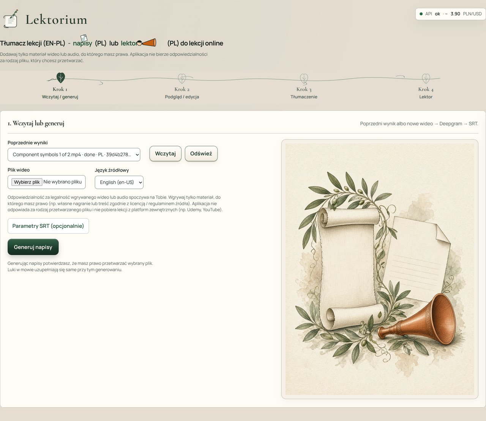
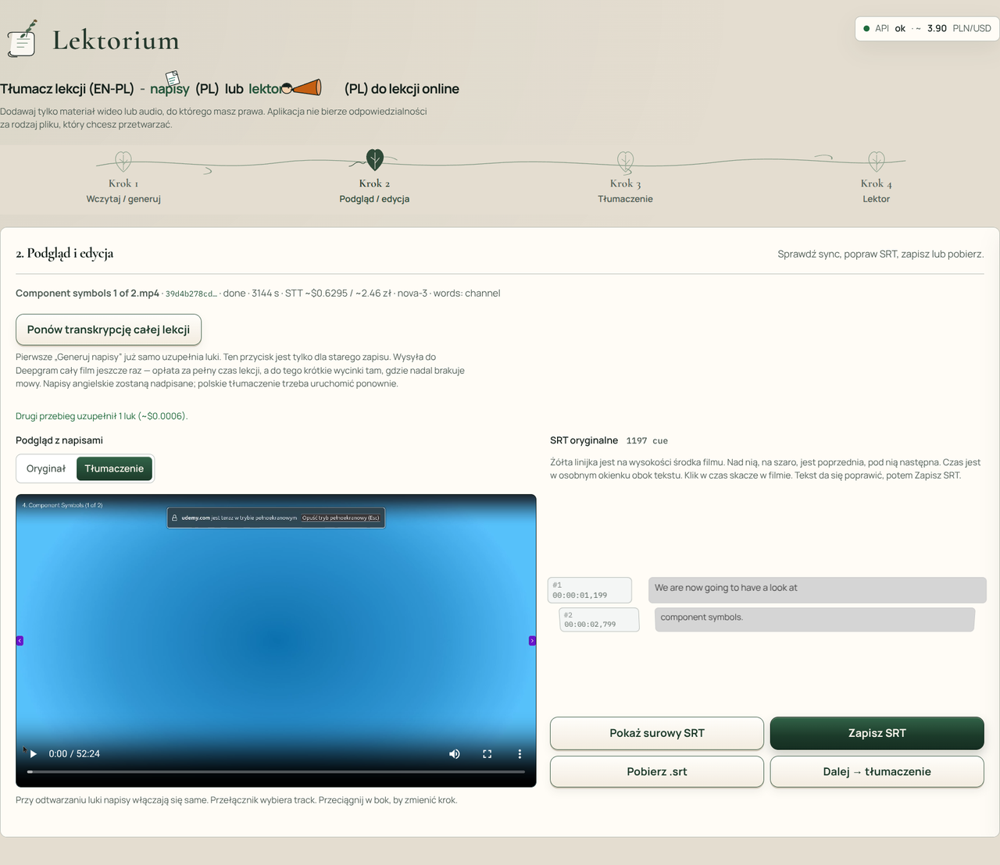
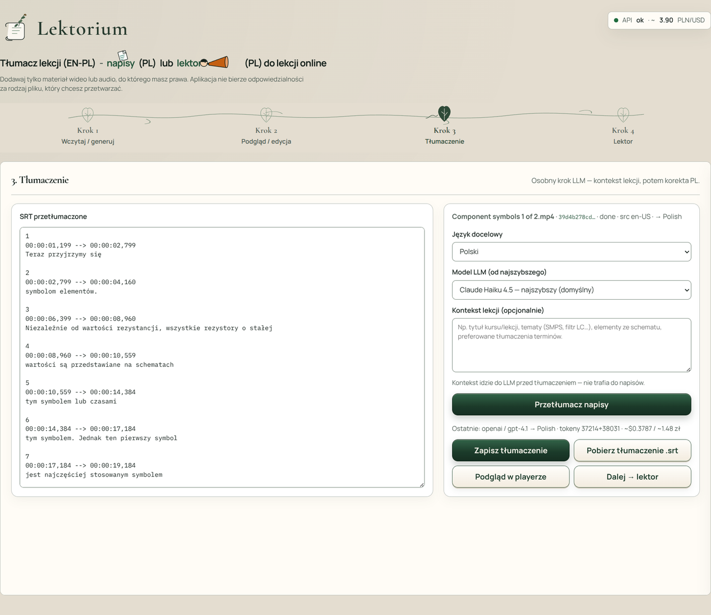
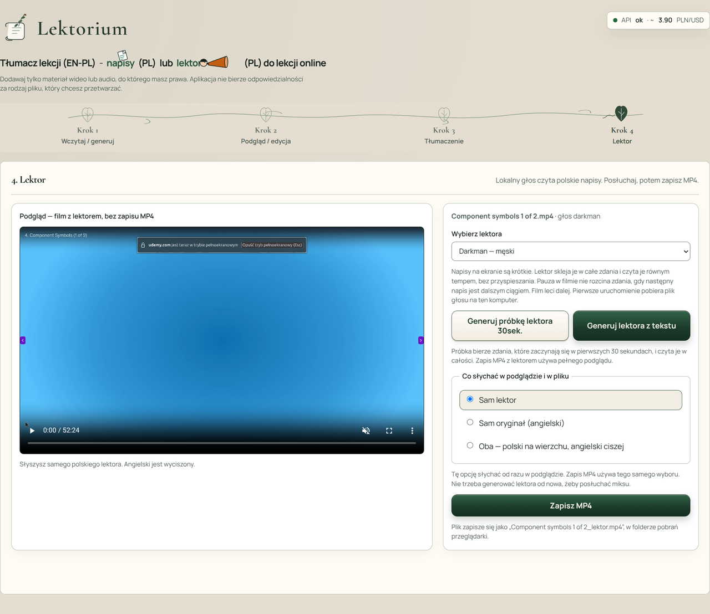

---
hide:
  - toc
---

[**PL - wersja**](.){ .lang-btn .lang-btn--active }

# Lektorium

<em>Lokalna aplikacja, która z angielskiej lekcji online robi polskie napisy albo głos lektora.</em>

---

## Po co powstał

Lekcja nagrana po angielsku jest cenna, dopóki da się w niej zostać. **Lektorium** ma jedno zadanie: **zostać przy treści**. Z filmu, do którego masz prawo, powstają polskie napisy, a potem — jeśli chcesz — głos, który czyta je w rytmie lekcji.

To narzędzie do nauki, nie do ściągania kursów z internetu. Materiał wgrywasz sam. Każdy kolejny krok zaczyna się dopiero wtedy, gdy o niego poprosisz: najpierw napisy, potem tłumaczenie, na końcu lektor.

---

## Co zyskujesz

- **Lekcja po polsku** — czytasz napisy albo słuchasz lektora, zamiast co chwilę zatrzymywać film przy słowniku.
- **Cztery krótkie etapy** — wczytanie, podgląd, tłumaczenie, lektor. Nic nie przeskakuje dalej samo.
- **Poprawka zanim poleci głos** — zdanie da się zmienić, zanim lektor je przeczyta.
- **Trzy sposoby słuchania** — sam lektor, sam oryginał albo oba naraz, z polskim na wierzchu.
- **Film zostaje u Ciebie** — zapis trafia do folderu pobrań na Twoim komputerze.

---

## Jak wygląda praca w aplikacji

Krótkie opisy pod kolejnymi etapami, które użytkownik przechodzi na co dzień.

*Wczytanie — wrzucasz lekcję, do której masz prawa, albo wracasz do wcześniejszej i prosisz o napisy.*

*Podgląd — oglądasz film z napisami, poprawiasz zdanie i dopiero wtedy idziesz do tłumaczenia.*

*Tłumaczenie — po lewej polski tekst, po prawej prośba o przekład. Możesz dopisać, o czym jest lekcja.*

*Lektor — wybierasz głos, słuchasz próbki albo całości i zapisujesz film: sam lektor, sam oryginał, albo oba.*

---

## Stos technologiczny

Dla osób zainteresowanych „jak to jest zrobione” — skrót na dole strony.

| Warstwa | Technologie |
|---|---|
| **Gdzie działa** | Lokalnie na komputerze użytkownika, w przeglądarce. Nie jest to usługa w internecie, na którą zakładasz konto. |
| **Ekran** | React, TypeScript, Vite |
| **Silnik** | Python, FastAPI (katalog `backend/`, środowisko `backend/.venv`) |
| **Mowa → napisy** | Deepgram, model nova-3. Płatna usługa w chmurze: liczy się czas nagrania. Plik wideo zostaje na tym komputerze, do usługi idzie ścieżka dźwiękowa. |
| **Tłumaczenie** | Osobny, płatny krok. Domyślnie Claude Haiku 4.5; da się przełączyć na inne modele Claude i GPT. Do prośby można dołączyć krótki opis lekcji (temat, terminy). |
| **Lektor** | Lokalnie, na procesorze: Piper. Głosy **Darkman** (męski, domyślny) i **Gosia** (żeński). Czyta całe zdania, równym tempem. Jeśli zdanie jest dłuższe niż okienko napisu, następna linia czeka. |
| **Słuchanie i zapis** | Trzy tryby: sam lektor (oryginał wyciszony), sam oryginał, oba (polski normalnie, angielski ciszej). Zapis wideo składa ffmpeg. Nazwa pliku z lektorem: `{nazwa lekcji}_lektor.mp4`, w folderze pobrań przeglądarki. |
| **Napisy** | SRT. Podgląd przy filmie i ręczna poprawka przed tłumaczeniem i przed lektorem. |
| **Start** | `./dev.sh` albo `npm run dev` |

---

Strona portfolio · Robert Bąk · Lektorium (PL) · 2026

