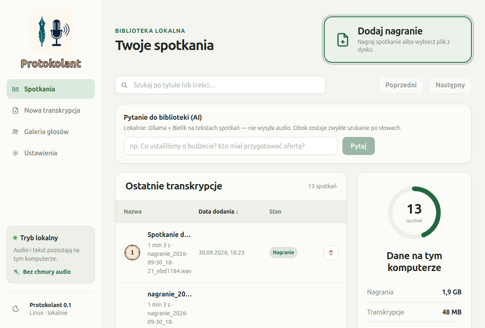
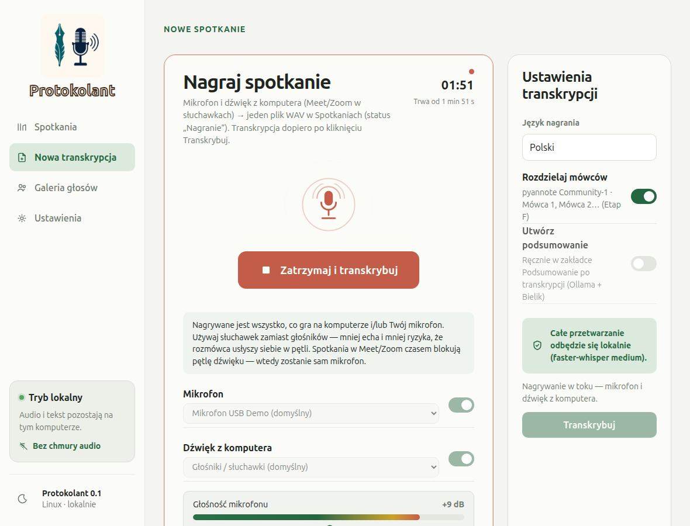
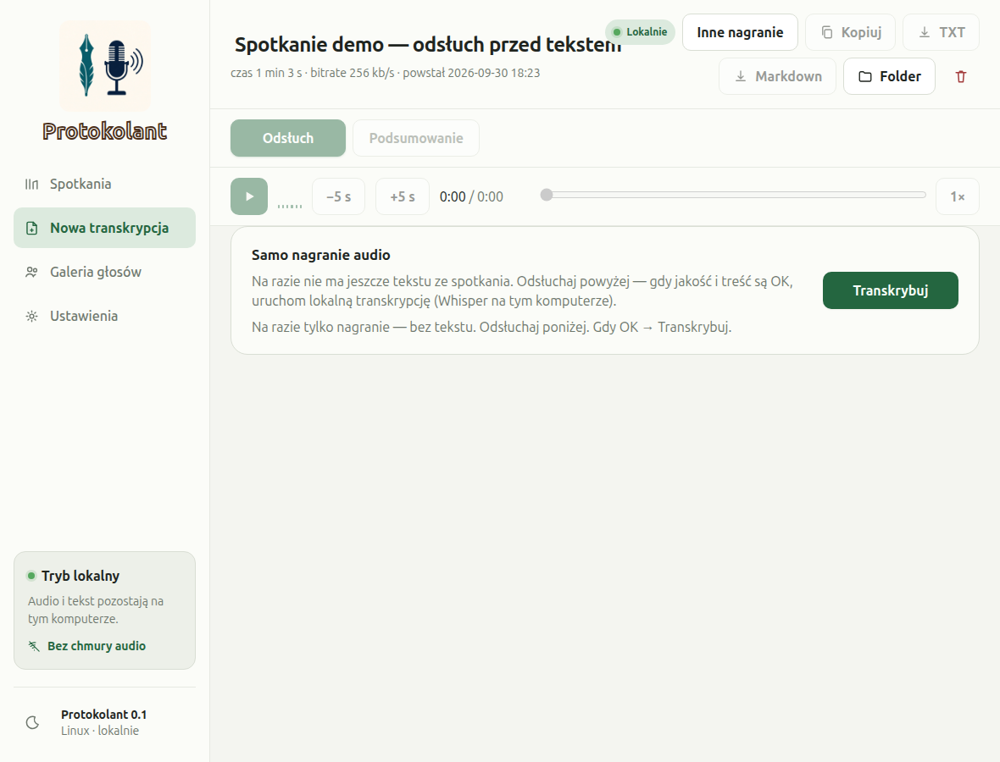
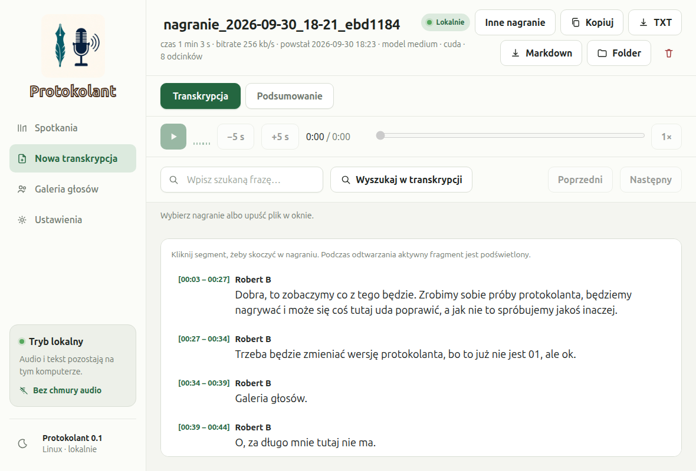
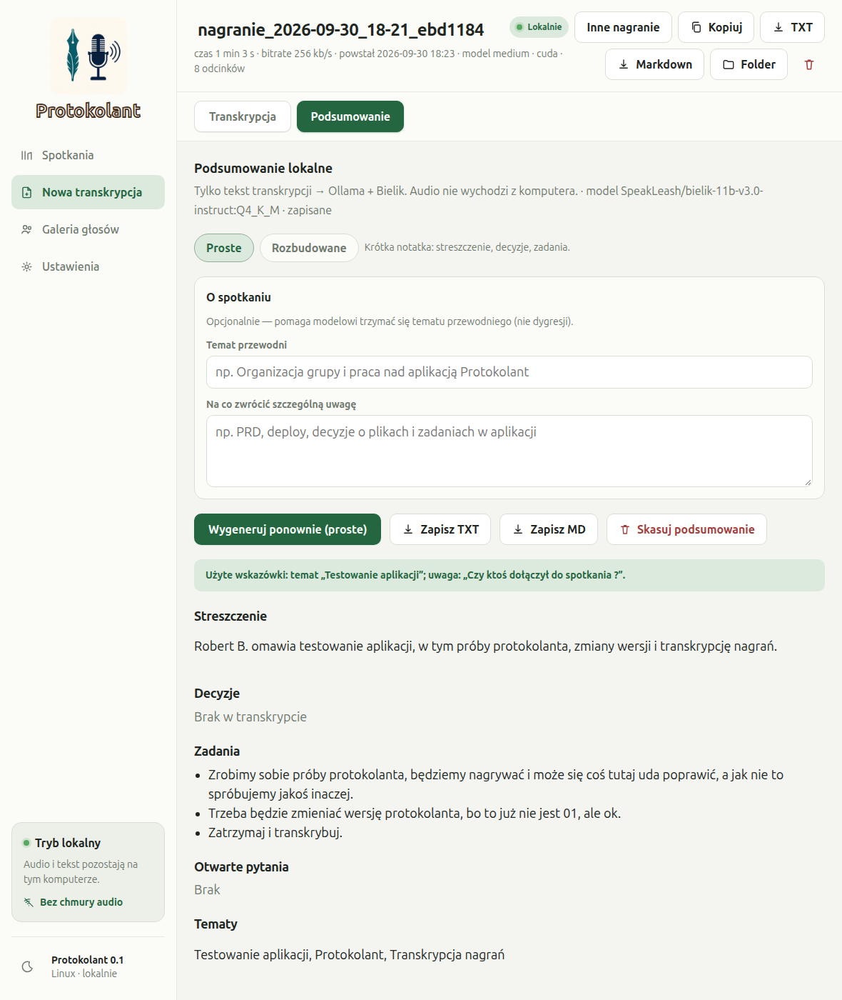

---
hide:
  - toc
---

[**PL - wersja**](.){ .lang-btn .lang-btn--active }

# Protokolant

<em>Lokalna aplikacja do nagrywania spotkań, zamiany mowy na tekst i krótkich protokołów — bez wysyłania audio do chmury.</em>

---

## Po co powstał

Spotkania online i rozmowy służbowe zostawiają ślad w głowie, a nie w notatniku. **Protokolant** ma jedno proste zadanie: **zostawić u Ciebie na komputerze** nagranie, czytelny zapis rozmowy i krótkie podsumowanie — żeby wrócić do ustaleń bez żmudnego przepisywania.

Nie jest to kolejna usługa w przeglądarce, do której wrzucasz nagranie. To **program na Twoim komputerze**. Pliki audio i treść rozmowy **nie wychodzą do internetu** w ramach pracy aplikacji.

---

## Co zyskujesz

- **Prywatność na pierwszym miejscu** — nagranie i tekst zostają lokalnie; nic nie jest wysyłane „do chmury” jako usługa transkrypcji.
- **Pełna ścieżka od calla do notatki** — nagraj, odsłuchaj, zamień na tekst, przejrzyj, zrób krótkie podsumowanie.
- **Kontrola przed ciężką pracą** — najpierw możesz odsłuchać nagranie i dopiero wtedy zlecić zamianę na tekst.
- **Biblioteka spotkań** — lista nagrań i wyników w jednym miejscu, gotowa do powrotu po czasie.
- **Pytania do własnych protokołów** — możesz zapytać o ustalenia z wielu spotkań naraz, nadal lokalnie.

---

## Jak wygląda praca w aplikacji

Krótkie opisy pod kolejnymi etapami, które użytkownik przechodzi na co dzień.

*Biblioteka spotkań — tu wracasz do nagrań i gotowych zapisów.*

*Nagrywanie — Rec podczas rozmowy; dźwięk trafia na Twój dysk, nie na serwer zewnętrzny.*

*Odsłuch — najpierw sprawdzasz jakość nagrania, potem dopiero zamiana na tekst.*

*Transkrypt — czytelny zapis rozmowy po polsku, do przeglądania i eksportu.*

*Podsumowanie — krótka notatka ze spotkania: sens rozmowy i ustalenia, bez przepisywania wszystkiego ręcznie.*

---

## Bezpieczeństwo danych (w skrócie)

| Zasada | Co to znaczy dla Ciebie |
|---|---|
| **Lokalnie na PC** | Aplikacja działa u Ciebie na komputerze (Linux na start). |
| **Audio nie idzie do chmury** | Nagranie nie jest wysyłane do zewnętrznej usługi transkrypcji. |
| **Ty decydujesz o plikach** | Spotkania i wyniki są u Ciebie — nie w czyjejś bazie SaaS. |

---

## Stos technologiczny

Dla osób zainteresowanych „jak to jest zrobione” — skrót na dole strony.

| Warstwa | Technologie |
|---|---|
| **Aplikacja desktop** | Tauri 2, React, TypeScript (UI); Rust (rama okna, nagranie, pliki, baza) |
| **Silnik mowy → tekst** | Python, faster-whisper (model medium, język PL), CUDA z fallbackiem na CPU |
| **Komunikacja UI ↔ silnik** | JSON Lines (stdin/stdout), bez lokalnego HTTP na start |
| **Dane lokalne** | SQLite (lista spotkań), pliki audio i eksport w katalogu użytkownika (`~/.local/share/swietliki/`) |
| **Podsumowania / pytania do biblioteki** | lokalny model językowy przez Ollama (Bielik) — nadal na maszynie użytkownika |
| **Audio** | FFmpeg (m.in. miks źródeł, regulacja głośności, segmenty nagrania) |
| **Eksport** | TXT, Markdown |
| **Środowisko** | Linux (start), conda `swietliki`, Python 3.12 |
| **Repo (kod)** | [github.com/robetr286/swietliki](https://github.com/robetr286/swietliki) (nazwa produktu: **Protokolant**) |

---

Strona portfolio · Robert Bąk · Protokolant (PL) · 2026

