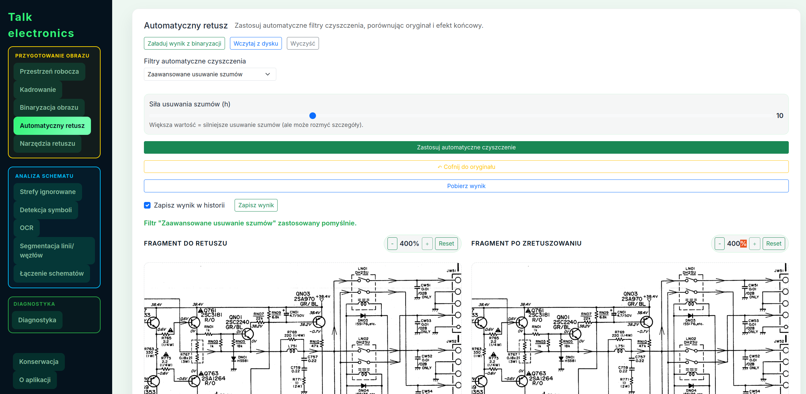
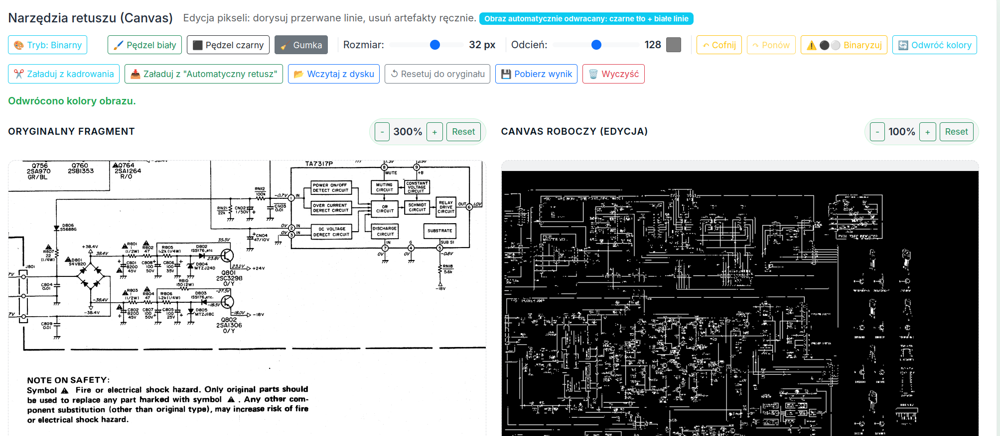
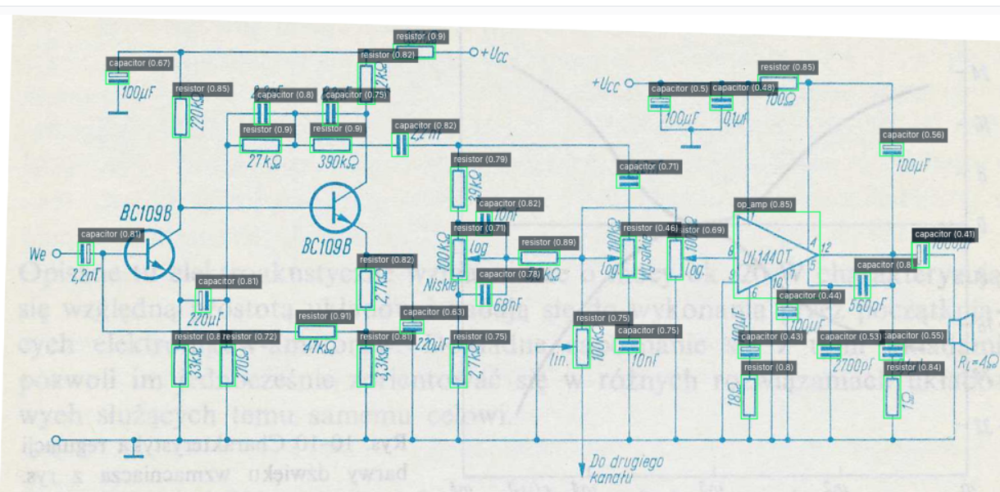
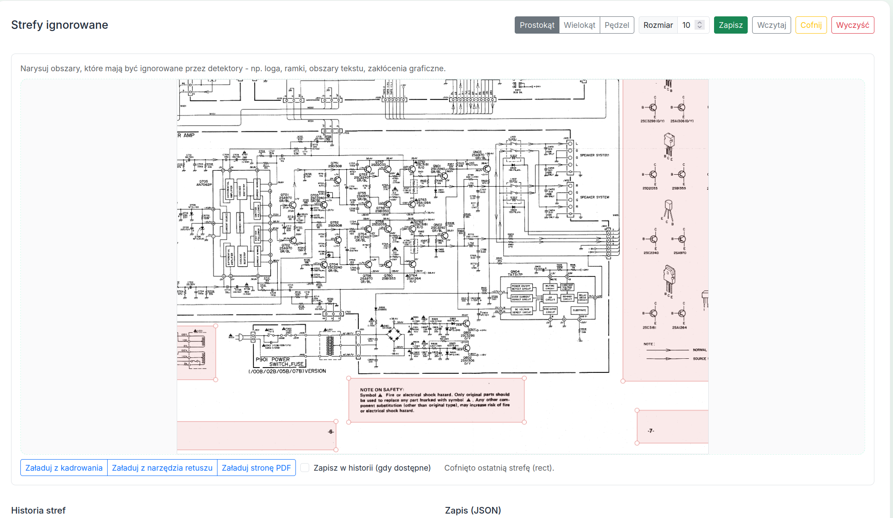
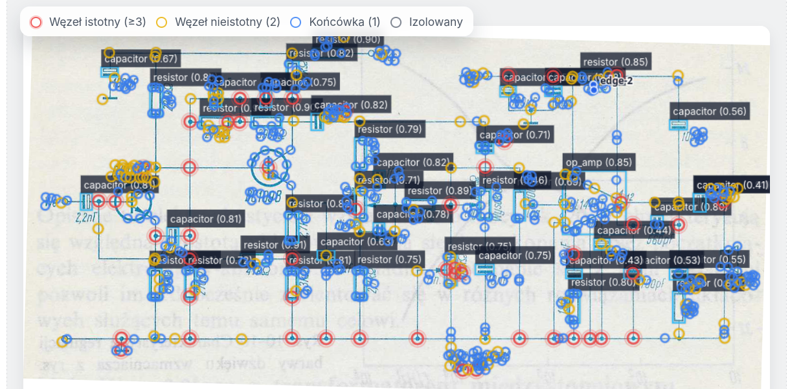
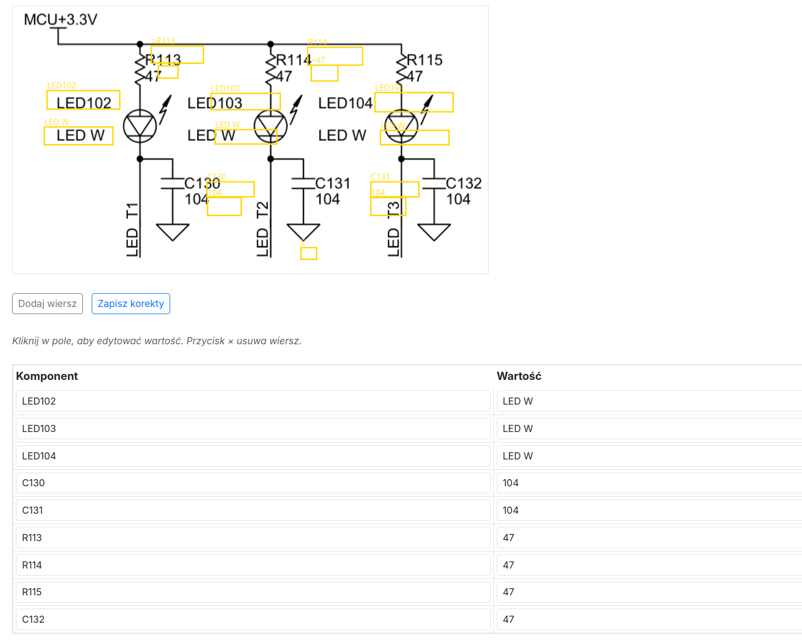

[**PL - wersja**](../../Talk_electronics/){ .lang-btn }
[**EN - version**](.){ .lang-btn .lang-btn--active }

# Talk Electronics — AI-Powered Schematic Analysis

<em>From schematic scan to diagnostics and netlist — an end-to-end AI product for electronics</em>

---

## What is Talk Electronics?

**Talk Electronics** is an AI application I am building for automatic analysis of electronic schematics. The system turns PDF scans and circuit photos into machine-readable data: it detects components, reads designators and values, builds a netlist, and supports step-by-step diagnostics.

I have been developing the project since September 2025 in a broad role that combines product thinking, data science, QA, and practical use of AI tools to speed up development. I own both the product direction and technical decisions for the OCR pipeline, object detection, data quality, and user experience.

*Main UI — automatic schematic retouch, tab navigation, and retouch filter selection*

---

## What the app can do

### Symbol detection (AI)

At the core is an **RT-DETR-L** (Real-Time Detection Transformer) detector that recognizes electronic components on a schematic: resistors, capacitors, transistors, ICs, inductors, and diodes.

- Bounding-box overlay drawn directly on the schematic
- Results table with class label, confidence, and coordinates
- Lazy GPU loading — VRAM allocated only on first use
- Multiple sources: PDF page, image file, data-URL

*Retouch tools palette*

### OCR — reading text from schematics

The OCR module, based on **PaddleOCR PP-OCRv4**, reads schematic text with pixel-level boxes and is the key step from image to structured data:

- **Categorization** — token type: component designator (R1, Q410), value (33K, 2SC1740), net label (VCC, GND), other
- **Smart pairing** — pairing designators with values (Q410 → 2SC1740, R436 → 100K), with semiconductor-aware matching for transistors
- **Post-processing** — multi-stage token cleanup: OCR correction (1O0K→100K), merging vertical fragments, noise removal, fixing semiconductor marks (2SCI740→2SC1740)
- **Clickable bounding boxes** — every recognized string is interactive on the canvas

*Object detection*

### Advanced graphics editor

An image-preparation module built for real schematics: damaged, skewed, noisy, or photographed in difficult conditions.

- **Cropping** — rectangular and polygonal (polygon)
- **Deskew** — automatic deskew plus a manual angle slider
- **Canvas editor** — brush, eraser, multi-color drawing with stroke width control
- **Binarization** — Otsu, adaptive, and manual threshold
- **Retouch** — denoise, morphological filters, median, blur cleanup
- **Undo/Redo** — full operation history

*Ignored regions tab*

### Netlist generation and SPICE export

From detected symbols and line segmentation the app builds a connectivity graph and produces a netlist for further analysis:

- Automatic line extraction (skeletonization) and junctions
- Netlist with edge graph and cycle detection
- **Edge connectors** — multi-page schematic linking with a connector form
- **SPICE export** (.cir) — a deck ready for circuit simulation

*Line / junction graph detection*

### Diagnostic AI chat

The chat module uses the generated netlist as context for an AI diagnostic layer:

- Suggested measurements (voltage, resistance, drop)
- Flagging suspicious nodes and anomalies
- Step-by-step repair guidance
- Isolating problem sections of the schematic

---

*OCR model and correction tab*

## Technology stack

The stack was chosen for real CV/AI product needs: document processing, unusual input data, iterative model development, and a path to production deployment.

### Backend

| Technology | Role |
|---|---|
| **Python 3.11** | Primary language |
| **Flask** | Web framework (factory pattern + Blueprints) |
| **REST API** | Frontend–backend communication (JSON) |

### AI / Machine Learning

| Model / library | Role |
|---|---|
| **RT-DETR-L** (Ultralytics) | Electronic symbol detection (transformer) |
| **PaddleOCR PP-OCRv4** | OCR with precise bounding boxes |
| **PyTorch** | Deep-learning framework |
| **PaddlePaddle 3.3** | Framework for OCR |

### Image processing

| Library | Role |
|---|---|
| **OpenCV** | Binarization, morphology, deskew, filters |
| **PyMuPDF** (fitz) | PDF → PNG rendering |
| **Pillow** | Image manipulation, masks |
| **NumPy** | Array operations |

### Frontend

| Technology | Role |
|---|---|
| **JavaScript** (modular) | UI logic |
| **Canvas API** | Interactive image editor |
| **Bootstrap 5.3** | Responsive layout |
| **HTML/CSS** | User interface |

### Testing and code quality

| Tool | Role |
|---|---|
| **Pytest** | Unit/integration tests (284+) |
| **Playwright** | E2E tests (smoke + full) |
| **GitHub Actions** | CI/CD with automated checks |
| **Pre-commit hooks** | isort, flake8, YAML validation |

### Infrastructure

| Technology | Role |
|---|---|
| **Linux (Ubuntu)** | Runtime environment |
| **Docker** | Containerization (GPU training) |
| **Conda** | Environment management |
| **DigitalOcean** | Target hosting |

---

## Synthetic training-data pipeline

A strong part of the project is the **training-data generation pipeline**, which reduces dependence on hand-labeled sets and speeds up model experiments:

1. **PIL mock generator** → random component placement, PNG export + JSON/COCO annotations
   *(KiCad API integration planned)*
2. **Export** → PNG with COCO annotations
3. **Augmentations** — albumentations: noise, blur, rotation, dropout (profiles: light/scan/heavy)
4. **Conversion** → COCO → YOLO format with automatic train/val/test split

The model therefore learns not only on hand-prepared data but also on thousands of synthetically generated schematics. Product- and engineering-wise that means faster iterations, easier hypothesis testing, and tighter control of dataset quality.

---

## Where we are heading

### Vision

Talk Electronics aims to become a **complete tool for electronics analysis and diagnostics** that:

- Turns every schematic scan into an interactive, machine-readable document
- Guides the user step by step through fault diagnosis
- Learns from every correction — the more repairs, the more accurate the system

### Near-term goals

| Phase | Description | Target |
|---|---|---|
| **Phase I** | Full OCR + RT-DETR + netlist integration | ✅ Done (August 2026) |
| **Phase II** | Beta pipeline: Image → detection → OCR → netlist → AI chat | ✅ Done locally (September 2026) |
| **Phase III** | Production deploy on DigitalOcean + hard-schematic testing | June 2027 |

### Longer-term vision

- **Diagnostic dialogue** — suggested measurements and a structured diagnosis path
- **Repair process** — which parts to replace and how to verify the fix
- **Self-improving** — every user correction feeds the training base
- **Legacy hardware** — 1970s–90s paper schematics, damaged and hard to read

---

## Key differentiators

**End-to-End Pipeline** 
Not a single model, but a full path: from PDF and preprocessing, through detection and OCR, to netlist, diagnostics, and SPICE export.

**Local AI** 
RT-DETR and PaddleOCR run locally, lowering operating cost and keeping full control of input data.

**Interactive editing** 
The canvas editor supports the operator at every stage: crop, retouch, deskew, and ignored regions.

**284+ automated tests** 
Unit and E2E (Playwright) coverage plus automated quality gates in CI/CD.

**Synthetic data pipeline** 
PIL mock generator → COCO → YOLO with augmentations scales dataset and model development.

**Human + AI duo** 
The project shows practical use of AI tools in development: faster iterations with product and technical control retained.

---

## Repository

[:fontawesome-brands-github: Talk Electronics on GitHub](https://github.com/robetr286/Talk_electronic_cursor){ .md-button .md-button--primary }

---

Portfolio site · Robert Bąk · September 2026

