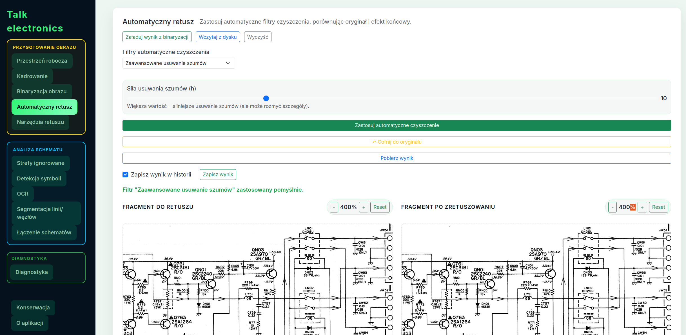
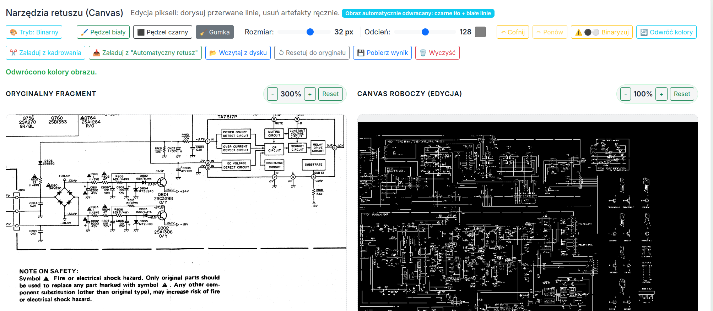
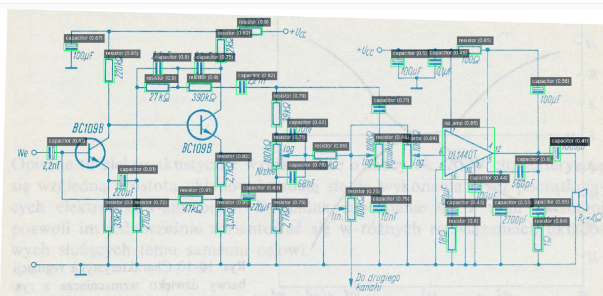
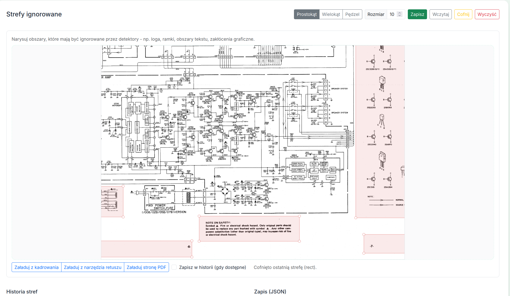
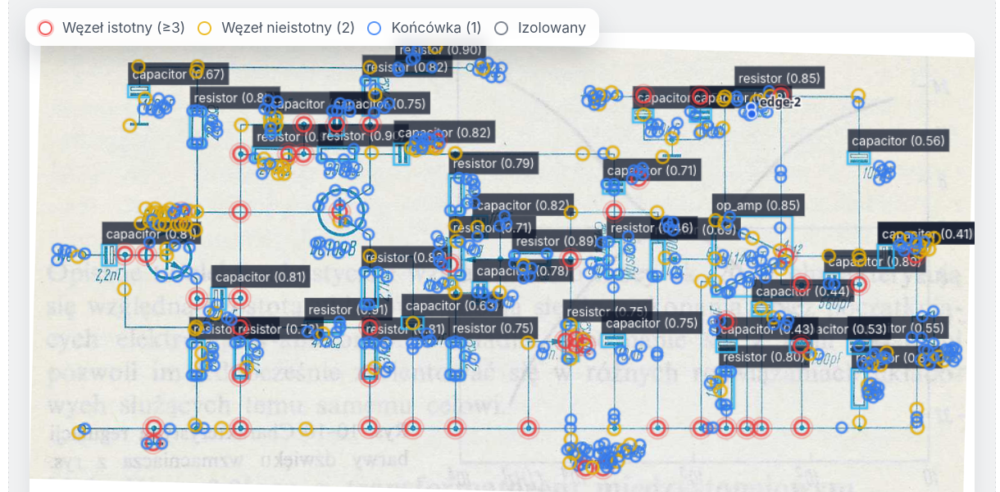
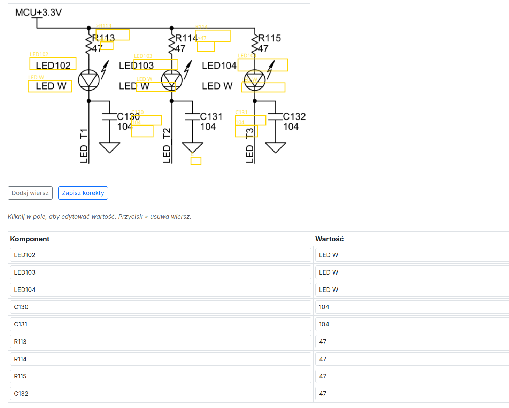

# Talk Electronics — AI-Powered Schematic Analysis

<em>Od skanu schematu do diagnostyki i netlisty — end-to-end produkt AI dla elektroniki</em>

---

## Czym jest Talk Electronics?

**Talk Electronics** to rozwijana przeze mnie aplikacja AI do automatycznej analizy schematów elektronicznych. System przekształca skany PDF i zdjęcia obwodów w dane maszynowe: wykrywa komponenty, odczytuje ich oznaczenia i wartości, buduje netlistę oraz wspiera diagnostykę krok po kroku.

Projekt rozwijam od września 2025 w szerokiej roli łączącej product thinking, data science, QA i praktyczne wykorzystanie narzędzi AI do przyspieszania developmentu. Odpowiadam zarówno za kierunek produktu, jak i za decyzje techniczne dotyczące pipeline'u OCR, detekcji obiektów, jakości danych oraz doświadczenia użytkownika.

*Interfejs główny — automatyczny retusz schematu, nawigacja między zakładkami, wybór filtrów do retuszu*

---

## Co potrafi aplikacja?

### 🔍 Detekcja symboli elektronicznych (AI)

Sercem aplikacji jest detektor oparty o **RT-DETR-L** (Real-Time Detection Transformer), rozpoznający komponenty elektroniczne na schemacie: rezystory, kondensatory, tranzystory, układy scalone, cewki i diody.

- Wizualizacja bounding boxów bezpośrednio na schemacie
- Tabela wyników z etykietą, pewnością i współrzędnymi
- Lazy-loading GPU — pamięć alokowana dopiero przy pierwszym użyciu
- Obsługa wielu źródeł: strona PDF, plik graficzny, data-URL

*Paleta narzędzi retuszu*

### 📝 OCR — odczyt tekstu ze schematów

Moduł OCR oparty o **PaddleOCR PP-OCRv4** odczytuje tekst ze schematu z precyzją pikselową i stanowi kluczowy element przejścia od obrazu do danych strukturalnych:

- **Kategoryzacja** — automatyczne rozpoznawanie typu tokena: komponent (R1, Q410), wartość (33K, 2SC1740), etykieta sieci (VCC, GND), inne
- **Smart pairing** — inteligentne parowanie komponentów z ich wartościami (Q410 → 2SC1740, R436 → 100K) z uwzględnieniem semantyki (tranzystory parują z modelami półprzewodników)
- **Postprocessing** — wieloetapowy pipeline czyszczenia tokenów korekcja OCR (1O0K→100K), scalanie fragmentów pionowych, usuwanie szumu, naprawa oznaczeń półprzewodników (2SCI740→2SC1740)
- **Klikalne bounding boxy** — każdy rozpoznany tekst jest interaktywny na Canvasie

*Wykrywanie obiektów*

### ✏️ Zaawansowany edytor graficzny

Kompleksowy moduł przygotowania obrazu zaprojektowany pod realne schematy: zniszczone, przekrzywione, zaszumione lub sfotografowane w trudnych warunkach.

- **Kadrowanie** — prostokątne i wielokątne (polygon)
- **Prostowanie** — automatyczny deskew + ręczny suwak kąta
- **Canvas editor** — pędzel, gumka, rysowanie w różnych kolorach z regulacją grubości
- **Binaryzacja** — metoda Otsu, adaptacyjna, ręczny próg
- **Retusz** — usuwanie szumu, filtry morfologiczne, medianowe, denoise
- **Undo/Redo** — pełna historia operacji

*Zakładka [Strefy ignorowane]*

### 🔗 Generowanie netlisty i eksport SPICE

Na podstawie wykrytych symboli i segmentacji linii aplikacja buduje graf połączeń, który prowadzi do wygenerowania netlisty gotowej do dalszej analizy:

- Automatyczna ekstrakcja linii (szkieletyzacja) i węzłów
- Generowanie netlisty z grafem krawędzi i cyklami
- **Edge Connectors** — łączenie wielostronicowych schematów z formularzem konektorów
- **Eksport do SPICE** (.cir) — gotowy deck do symulacji obwodu

*wykrywanie linii*

### 💬 Diagnostyczny chat AI

Moduł czatu wykorzystuje wygenerowaną netlistę jako kontekst dla warstwy diagnostycznej AI:

- Sugestie pomiarów (napięcie, rezystancja, spadek)
- Flagowanie podejrzanych węzłów i anomalii
- Krok po kroku przez proces naprawy
- Izolacja problemowych sekcji schematu

---

*Zakładka modelu OCR i korekcji*

## 🧰 Stos technologiczny

Stack został dobrany pod realne wymagania produktu CV/AI: przetwarzanie dokumentów, obsługę nietypowych danych wejściowych, iteracyjny rozwój modeli oraz możliwość przyszłego wdrożenia produkcyjnego.

### 🖥️ Backend

| Technologia | Zastosowanie |
|---|---|
| **Python 3.11** | Język główny |
| **Flask** | Framework webowy (factory pattern + Blueprints) |
| **REST API** | Komunikacja frontend-backend (JSON) |

### 🤖 AI / Machine Learning

| Model / Biblioteka | Zastosowanie |
|---|---|
| **RT-DETR-L** (Ultralytics) | Detekcja symboli elektronicznych (transformer) |
| **PaddleOCR PP-OCRv4** | OCR z precyzyjnymi bounding boxami |
| **PyTorch** | Framework deep learning |
| **PaddlePaddle 3.3** | Framework dla OCR |

### 🖼️ Przetwarzanie obrazów

| Biblioteka | Zastosowanie |
|---|---|
| **OpenCV** | Binaryzacja, morfologia, deskew, filtry |
| **PyMuPDF** (fitz) | Rendering PDF → PNG |
| **Pillow** | Manipulacja obrazami, maski |
| **NumPy** | Operacje macierzowe |

### 🎛️ Frontend

| Technologia | Zastosowanie |
|---|---|
| **JavaScript** (modularny) | Logika UI |
| **Canvas API** | Interaktywny edytor obrazu |
| **Bootstrap 5.3** | Responsywny layout |
| **HTML/CSS** | Interfejs użytkownika |

### ✅ Testy i jakość kodu

| Narzędzie | Zastosowanie |
|---|---|
| **Pytest** | Testy unit/integration (284+ testów) |
| **Playwright** | Testy E2E (smoke + full) |
| **GitHub Actions** | CI/CD z automated checks |
| **Pre-commit hooks** | isort, flake8, YAML validation |

### 🏗️ Infrastruktura

| Technologia | Zastosowanie |
|---|---|
| **Linux (Ubuntu)** | Środowisko produkcyjne |
| **Docker** | Konteneryzacja (GPU training) |
| **Conda** | Zarządzanie środowiskiem |
| **DigitalOcean** | Docelowy hosting |

---

## 🧪 Pipeline danych syntetycznych

Jednym z mocniejszych elementów projektu jest **pipeline generowania danych treningowych**, który ogranicza zależność od ręcznie anotowanych zbiorów i przyspiesza eksperymenty modelowe:

1. **Mock generator PIL** → losowe rozmieszczanie komponentów, eksport PNG + anotacje JSON/COCO
   *(integracja KiCad API planowana w przyszłości)*
2. **Eksport** → PNG z anotacjami COCO
3. **Augmentacje** — albumentations: szum, blur, rotacja, dropout (profile: light/scan/heavy)
4. **Konwersja** → COCO → format YOLO z automatycznym splitem train/val/test

Dzięki temu model uczy się nie tylko na danych ręcznie przygotowanych, ale także na tysiącach automatycznie wygenerowanych schematów. Z perspektywy produktowej i inżynierskiej oznacza to szybsze iteracje, łatwiejsze testowanie hipotez i większą kontrolę nad jakością datasetu.

---

## 🧭 Dokąd zmierzamy?

### Wizja

Celem Talk Electronics jest stworzenie **kompletnego narzędzia do analizy i diagnostyki elektroniki**, które:

- Zamienia każdy skan schematu w interaktywny, maszynowo-czytelny dokument
- Prowadzi użytkownika krok po kroku przez diagnostykę usterki
- Uczy się na każdej korekcie — im więcej napraw, tym system celniejszy

### 🎯 Najbliższe cele

| Faza | Opis | Termin |
|---|---|---|
| **Faza I** | Pełna integracja OCR + RT-DETR + netlista | Kwiecień 2026 |
| **Faza II** | Beta pipeline: Obraz → detekcja → OCR → netlista → chat AI | Czerwiec 2026 |
| **Faza III** | Deploy produkcyjny na DigitalOcean + testy na trudnych schematach | Sierpień 2026 |

### 🔭 Długofalowa wizja

- **Dialog diagnostyczny** — system sugeruje konkretne pomiary i buduje przebieg diagnozy
- **Proces naprawy** — wskazania, które elementy wymienić i jak zweryfikować naprawę
- **Self-improving** — każda korekta użytkownika trafia do bazy treningowej, model staje się coraz lepszy
- **Obsługa legacy hardware** — schematy z lat 70–90, papierowe, zniszczone, słabo czytelne

---

## Kluczowe wyróżniki

**🔄 End-to-End Pipeline** 
Nie pojedynczy model, lecz pełna ścieżka: od PDF i preprocessingu, przez detekcję i OCR, do netlisty, diagnostyki i eksportu SPICE.

**🏠 Lokalna AI** 
RT-DETR i PaddleOCR działają lokalnie, co obniża koszty operacyjne i daje pełną kontrolę nad danymi wejściowymi.

**✏️ Interaktywna edycja** 
Canvas editor wspiera operatora na każdym etapie: kadrowanie, retusz, deskew i definiowanie stref ignorowanych.

**🧪 284+ automatycznych testów** 
Projekt ma pokrycie testami unit i E2E (Playwright) oraz automatyczne kontrole jakości w CI/CD.

**📊 Syntetyczny pipeline danych** 
Mock generator PIL → COCO → YOLO z augmentacjami daje skalowalny sposób rozwoju datasetu i modeli.

**🤖 Duet człowiek + AI** 
Projekt pokazuje praktyczne wykorzystanie narzędzi AI w developmentcie: szybsze iteracje przy zachowaniu kontroli produktowej i technicznej.

---

## Repozytorium

[:fontawesome-brands-github: Talk Electronics na GitHub](https://github.com/robetr286/Talk_electronic){ .md-button .md-button--primary }

---

Strona portfolio · Robert Bąk · Marzec 2026

