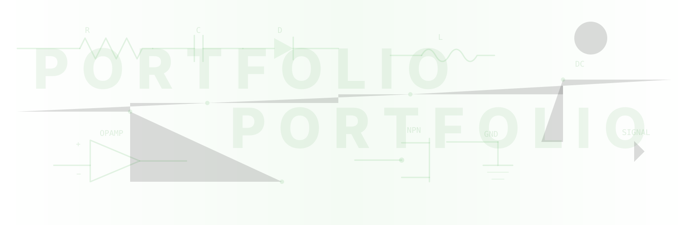

---
hide:
  - toc
  - navigation
---

[**PL - wersja**](pl/){ .lang-btn }
[**EN - version**](.){ .lang-btn .lang-btn--active }

# :fontawesome-solid-microchip:{ .hero-icon } Robert Bąk

### :fontawesome-solid-bolt: Talk Electronics

**Automatic analysis of electronic schematics**

A Flask web app that uses AI models (RT-DETR, PaddleOCR) to recognize component
symbols, build netlists, and support circuit diagnostics from uploaded PDF/PNG files.

[:octicons-arrow-right-24: View project](Talk_electronics/index.md){ .md-button .md-button--primary }

---

 :fontawesome-brands-github: [GitHub](https://github.com/robetr286) · :fontawesome-brands-linkedin: [LinkedIn](https://linkedin.com) · <a href="mailto:robetr@wp.pl" title="robetr@wp.pl" aria-label="robetr@wp.pl">:fontawesome-solid-envelope:</a> Contact

